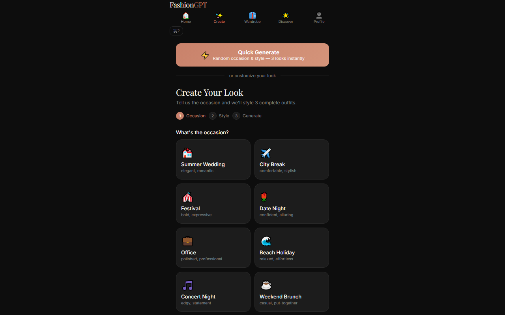
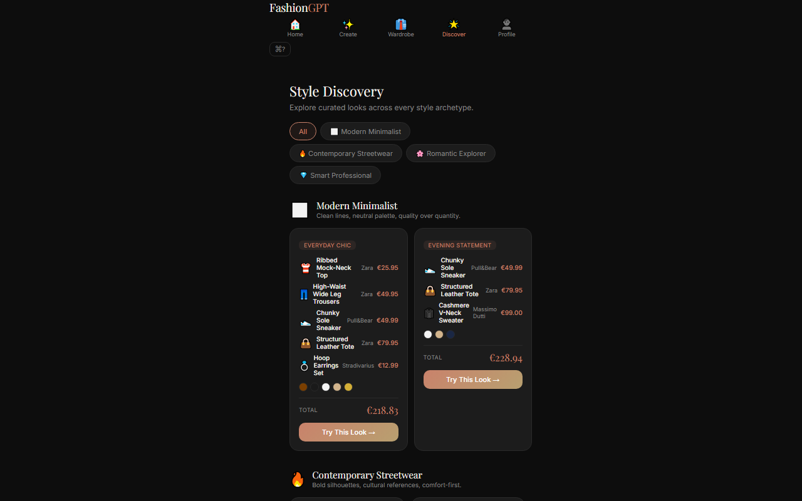

# FashionGPT

**Deterministic AI Stylist — Explainable, Offline-Capable, Multi-Brand**

FashionGPT is an intelligence-first outfit recommendation app for the Inditex ecosystem (Zara, Pull&Bear, Bershka, Stradivarius, Massimo Dutti, Oysho). Unlike a black-box chatbot, **every recommendation includes a visible reasoning trace**: why this occasion maps to this formality, why these colors harmonize, why this silhouette fits your archetype, and what confidence the system has in each dimension.

[](https://github.com/hexfix/fashiongpt/actions/workflows/ci.yml)

---

## Demo

| Tab | Screenshot |
|-----|-----------|
| **Home** — Weather-aware greeting, quick outfit generation, daily style tip |  |
| **Create** — 6-stage reasoning pipeline with per-dimension scoring |  |
| **Wardrobe** — Saved looks, capsule builder, style memory |  |
| **Discover** — Archetype profiles, product matches, trend radar |  |
| **Profile** — FashionDNA assessment, style evolution timeline |  |


*Every outfit card surfaces a full reasoning trace — confidence ring, "why chosen", per-dimension breakdown, rejected alternatives, and weather-aware recommendations.*

---

## Table of Contents

- [Key Design Decisions](#key-design-decisions)
- [Architecture](#architecture)
- [Features](#features)
- [Explainable-AI Pipeline](#explainable-ai-pipeline)
- [Tech Stack](#tech-stack)
- [Getting Started](#getting-started)
- [Project Structure](#project-structure)
- [Deployment](#deployment)
- [License](#license)

---

## Key Design Decisions

| Decision | Rationale |
|----------|-----------|
| **Deterministic engine first, AI second** | The app works fully offline with zero API keys. When a proxy is available, Claude enhances the outputs — but the core experience never depends on it. |
| **Explainability as a feature** | Every recommendation shows *why* it was chosen and *what styling problem* it solves. No black boxes. |
| **No UI library** | Vanilla CSS with custom properties keeps the bundle small (88 KB CSS, 225 KB JS) and avoids framework churn. |
| **Hash-based routing** | No router library needed for 5 tabs. Keeps dependencies minimal and deployment trivial. |

---

## Architecture

```
┌──────────────────────────────────────────────────────────────────┐
│                   Frontend (Vite SPA — React 18)                  │
│                                                                  │
│  ┌─────────────────┐   ┌──────────────┐   ┌───────────────────┐  │
│  │  Rule Engine     │   │  Reasoning   │   │     UI Shell       │  │
│  │  (6 TypeScript   │   │  Layer       │   │  (5 tab views)     │  │
│  │   modules)       │   │  Generates   │   │  Home ──── Create  │  │
│  └────────┬────────┘   │  explanation │   │  Wardrobe ── Disc. │  │
│           │            │  text +      │   │  Profile           │  │
│           ▼            │  scores for  │   └───────────────────┘  │
│  ┌─────────────────┐   │  every dim   │                          │
│  │  Config Layer   │   └──────┬───────┘                          │
│  │  isOfflineMode() │          │                                  │
│  │  detects:        │          ▼                                  │
│  │  no key ──▶ mock │  ┌─────────────────┐                       │
│  │  key ────▶ proxy │  │  OfflineEngine   │                       │
│  └─────────────────┘  │  seedOutfits()   │                       │
│                        │  buildOutfit-    │                       │
│                        │  Reasoning()     │                       │
│                        └─────────────────┘                       │
└────────────────────────────┬─────────────────────────────────────┘
                             │ POST /api/generate
                             ▼
              ┌────────────────────────────────────┐
              │   Express Proxy (server/index.js)   │
              │   ANTHROPIC_API_KEY (server-side)   │
              │   Routes: /api/generate             │
              └────────────────┬───────────────────┘
                               │
                               ▼
              ┌────────────────────────────────────┐
              │   Anthropic Messages API            │
              │   claude-sonnet-4-20250514          │
              │   Structured JSON output            │
              └────────────────────────────────────┘
```

**Dual-mode design**: When no API key is configured (`VITE_ANTHROPIC_API_KEY` or `VITE_API_PROXY_URL`), the `OfflineEngine` serves seed outfits with fully client-side reasoning — no external calls, no loading spinners. When a proxy is available, the engine's outputs are enhanced by Claude for richer variety. All reasoning is computed and rendered client-side in both modes.

---

## Features

### 5-Tab Navigation

| Tab | What it does |
|-----|-------------|
| **Home** | Weather-aware greeting (time/icon), quick 1-tap outfit generation, favorite outfits carousel, rotating daily style tip |
| **Create** | Multi-step outfit generator: occasion → archetype → color preference → 6-stage reasoning pipeline → 3 compared looks with full critique |
| **Wardrobe** | Saved looks (localStorage), capsule wardrobe builder (10-piece cross-brand), style memory panel with timeline |
| **Discover** | 8 archetype profiles with curated product matches, seasonal trend radar with direction bars (rising/falling/peaked) |
| **Profile** | FashionDNA assessment (archetype quiz & personal palette), Style Evolution (past looks timeline with gaps analysis) |

### Key Experiences

- **Occasion-first generation** — Pick from 20+ occasions (wedding, office, beach, festival...) and the system builds a complete look with formality matching, temperature-aware fabric selection, and color harmony scoring
- **6-stage reasoning pipeline** — Real-time animated "thinking" process: Occasion → DNA → Weather → Color → Formula → Confidence. Each stage shows live detail text that evolves every 1.8s
- **Weather-aware styling** — Live OpenWeather data (or built-in Madrid mock) adjusts fabric weight, layering strategy, and color temperature recommendations. Displayed inline on both the home screen and outfit results
- **Capsule wardrobe builder** — Generates a 10-piece cross-brand capsule from seed data with total cost, per-item prices, and outfit combinatorics (20+ outfits from 10 pieces)
- **Trend radar** — Live-style bars showing seasonal movements per category with color-coded direction (🟢 rising, 🟡 peaked, 🔴 falling)
- **FashionDNA quiz** — Multi-step archetype assessment determines your profile (Minimalist, Bohemian, Streetwear, Classic, etc.), personal color palette, confidence scores, and wardrobe gap analysis
- **Color harmony engine** — Scores outfit color pairs by wheel position (complementary, analogous, triadic, monochromatic) with adjustable weights
- **Explainable reasoning** — Every recommendation surfaces SVG confidence ring, natural-language "why this was chosen" statement, "what this solves" context, rejected alternatives with reasons, and per-dimension breakdown (occasion fit, color harmony, style coherence, trend alignment, budget fit, overall)
- **Offline-first** — Zero API keys needed. Rules engine + seed data produce the full experience. AI mode is additive, not required

---

## Explainable-AI Pipeline

Every outfit card surfaces a multi-dimensional reasoning trace rendered entirely on the client. No API calls are needed for this — it uses the rule engine's internal scores.

```
Generation Flow:
  Occasion ──▶ DNA ──▶ Weather ──▶ Color ──▶ Formula ──▶ Confidence
     │           │          │          │           │            │
     ▼           ▼          ▼          ▼           ▼            ▼
  formality   archetype  temp adj  pair score  silhouette   avg score
  mapping     matching   fabric     wheel pos  category     0-100%
```

**Rendered on every outfit card:**
- **Confidence ring** — SVG donut chart (0–100%) showing overall conviction, with pulse animation on mount
- **"Why this was chosen"** — Natural-language statement linking occasion → archetype → formality → weather
- **"What this solves"** — Context-aware styling challenge this look addresses
- **Rejected alternatives** — 2 lower-scoring alternatives with reasons
- **Per-dimension breakdown** — Confidence %, score bar, and reasoning text for each of the 6 dimensions
- **Weather recommendation** — Current temperature + condition + full styling recommendation inline

Example reasoning output:

> *"A 'Smart Casual' look for your office occasion. The slim-fit blazer adds structure (scoring 88% confidence for your Minimalist archetype), while the neutral palette adapts well to Madrid's 22°C weather. Avoids the overly formal suiting alternative that would mismatch the occasion's 'relaxed professional' expectation."*

---

## Tech Stack

| Layer | Technology |
|-------|-----------|
| UI | React 18, Vite 5, vanilla CSS with custom properties (88 KB) |
| Language | TypeScript 5 (strict mode) |
| Routing | Hash-based SPA — zero dependencies |
| State | React context + custom hooks (useMemory, useSavedOutfitsContext) |
| Offline engine | 6 deterministic rule modules: style, occasion, weather, color, outfit, critic (TypeScript) |
| AI provider | Anthropic Claude (claude-sonnet-4 — via Express proxy) |
| Backend proxy | Express.js (`server/index.js` — secures API key server-side) |
| Testing | Vitest + React Testing Library (34 tests, all pass) |
| Persistence | localStorage with context-backed save/load |
| CI | GitHub Actions (test + build + TypeScript strict check) |
| Bundle | 225 KB main + 95 KB lazy-loaded OutfitGenerator |

---

## Getting Started

### Prerequisites

- Node.js 18+
- npm 9+

### 1. Install

```bash
npm install
```

### 2. Configure (optional)

```bash
cp .env.example .env.local
```

FashionGPT runs **fully offline** with zero configuration. Optional env vars for live features:

| Feature | Variable | File |
|---------|----------|------|
| AI-enhanced generation | `ANTHROPIC_API_KEY` | `server/.env` |
| Live weather | `VITE_OPENWEATHER_API_KEY` | `.env.local` |
| Account persistence | `VITE_SUPABASE_URL` + `VITE_SUPABASE_ANON_KEY` | `.env.local` |

### 3. Start (two terminals for AI mode)

```bash
# Terminal 1 — Backend proxy (optional, only for AI features)
cd server
cp ../.env.example .env    # add ANTHROPIC_API_KEY
npm install
node index.js

# Terminal 2 — Frontend dev server
npm run dev
```

Open [http://localhost:5173](http://localhost:5173).

### 4. Build

```bash
npm run build
npm run preview
```

---

## Project Structure

```
fashiongpt/
├── public/                  # Static assets
├── server/
│   ├── index.js             # Express proxy (secures Anthropic key)
│   └── package.json
├── src/
│   ├── components/          # 27 React components (lazy-loaded OutfitGenerator)
│   │   ├── HomeScreen.jsx         # Weather-aware landing
│   │   ├── OutfitGenerator.jsx    # Multi-step generation (94 KB lazy chunk)
│   │   ├── OutfitCard.jsx         # Explainable outfit card with reasoning trace
│   │   ├── GeneratingAnimation.jsx # 6-stage real-time reasoning pipeline
│   │   ├── CriticScore.jsx        # Per-dimension score breakdown
│   │   ├── WeatherWidget.jsx      # Live/mock weather display
│   │   ├── FashionDNA.jsx         # Archetype quiz & palette
│   │   ├── Wardrobe.jsx           # Saved looks + capsule builder
│   │   ├── Discovery.jsx          # Archetype profiles + trend radar
│   │   └── ...                    # 18 more components
│   ├── rules/               # 6 deterministic rule engines (TypeScript)
│   │   ├── styleRules.ts    # Archetype profiles & tag matching
│   │   ├── occasionRules.ts # Occasion → formality mapping
│   │   ├── weatherRules.ts  # Temperature → fabric/layer/palette
│   │   ├── colorRules.ts    # Color wheel harmony scoring
│   │   ├── outfitEngine.ts  # Outfit generation orchestrator
│   │   └── index.ts         # Barrel export
│   ├── services/            # API clients & config (isOfflineMode, weather API)
│   ├── data/                # Product catalogs, occasions, archetypes
│   ├── hooks/               # Custom React hooks (useMemory, useOutfitGenerator, etc.)
│   ├── db/                  # Supabase client (optional — planned feature)
│   ├── context/             # React context providers
│   └── __tests__/           # Test suite (34 tests, Vitest + RTL)
├── docs/                    # Screenshots & documentation
│   ├── screenshot-home.png
│   ├── screenshot-create.png
│   ├── screenshot-wardrobe.png
│   ├── screenshot-discover.png
│   ├── screenshot-profile.png
│   └── screenshot-reasoning.png
├── .env.example             # Single source of truth for env vars
├── .github/workflows/       # CI pipeline (test → build → tsc)
├── vercel.json              # SPA routing for deployment
├── vite.config.js
└── package.json
```

---

## Deployment

### Frontend (Vercel / Netlify)

```bash
npm run build    # outputs to dist/
```

Deploy the `dist/` folder. Set `VITE_API_PROXY_URL` to your deployed proxy URL if using AI features. The app works in offline mode with zero config.

The included `vercel.json` handles SPA routing so direct URLs to any tab work correctly.

### Backend (Vercel serverless)

For AI-powered generation in production:

1. Deploy `server/index.js` as a [Vercel serverless function](https://vercel.com/docs/functions/serverless-functions)
2. Set `ANTHROPIC_API_KEY` as an environment variable
3. Set `VITE_API_PROXY_URL` in the frontend to point to your deployed function URL

---

## Testing

```bash
npm test          # 34 tests (Vitest + RTL)
npm run build     # Vite production build (0 errors)
npx tsc --noEmit  # TypeScript strict check (0 errors)
```

---

## License

MIT — see [LICENSE](LICENSE).

---

*Built with React, TypeScript, and Claude. Not affiliated with Inditex, Zara, or Anthropic. Product data is illustrative.*
